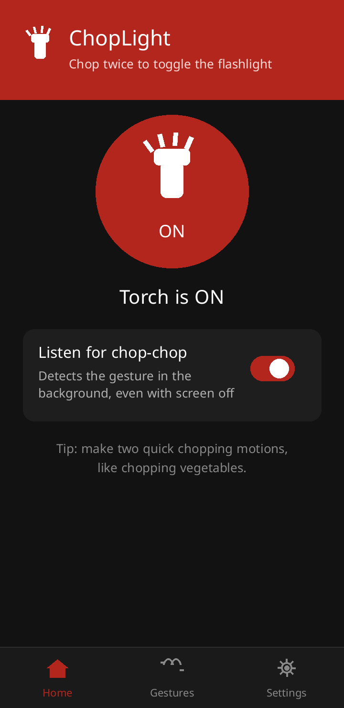
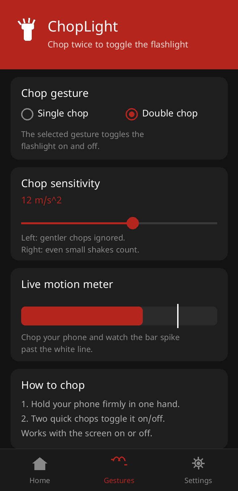
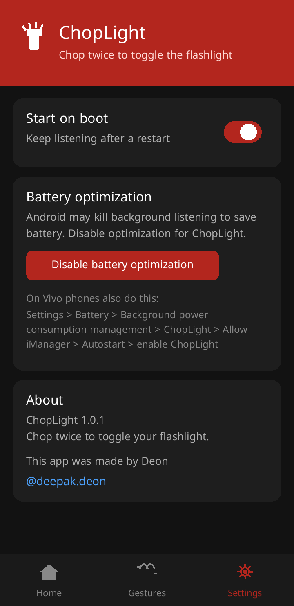

# ChopLight

Toggle your flashlight with a chopping motion — pick single or double chop, gesture, light on/off.

## Features

- **Selectable chop gesture** — choose Single chop or Double chop in the Gestures tab (default: Double chop); the selected gesture toggles the flashlight
- **Accelerometer-based detection** — peak detection with a 2.5s cooldown to avoid re-triggers
- **Background listening** — a foreground service keeps detecting the gesture even with the screen off (partial wake lock)
- **Sensitivity slider** — tune the detection threshold (6–20 m/s²)
- **Live motion meter** — watch the accelerometer bar spike past the threshold line while you chop
- **Start on boot** — optionally resume listening after a restart
- **Battery-whitelist guide** — in-app steps to keep the listener alive on aggressive phones (incl. Vivo)
- Fully offline, no ads, no tracking

## Screenshots

| Home | Gestures | Settings |
|---|---|---|
|  |  |  |

## Build

With Android Studio: open the project and build — dependencies resolve from Google's Maven and Maven Central (internet needed on first build).

From the command line:

```bash
./gradlew assembleDebug
```

(The included `offline-build.sh` is an alternate wrapper for the author's vendored offline toolchain; it is not needed on a normal machine.)

The APK is produced at `app/build/outputs/apk/debug/app-debug.apk`.
Requires Android 8.0 (API 26)+. Grant the Camera permission on first launch (needed for `setTorchMode`), and disable battery optimization for ChopLight so background listening isn't killed.

## Download

Grab the latest APK from the [Releases](https://github.com/D30N/ChopLight/releases) page.

---
This app was made by Deon — [@deepak.deon](https://instagram.com/deepak.deon)
